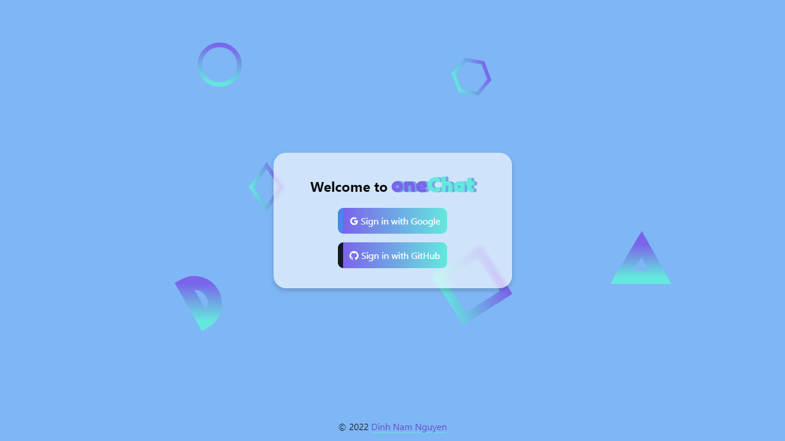
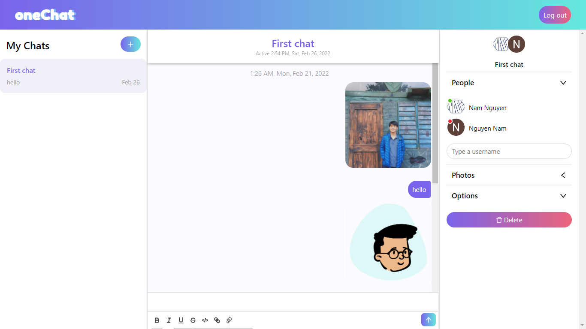

# </img> Simple ReactJS Chat app

### **[→ View site](https://onechatreact.netlify.app)**

## Preview
 

## Features
  - Sign in with Gmail or GitHub using Firebase.
  - User-friendly UI using ReactJS.
  - Custom chat app with Chatengine.io.

 

